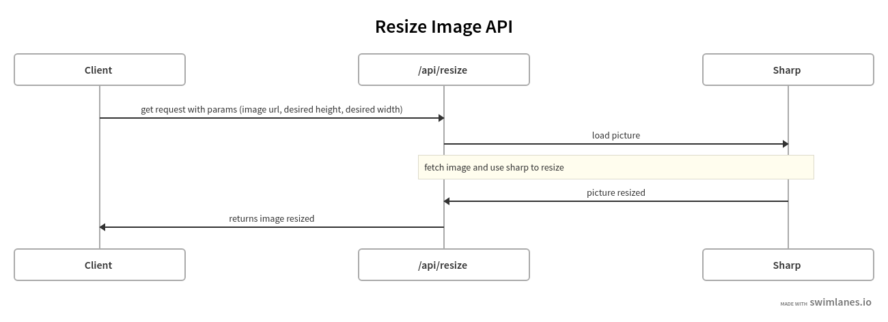

## Task - Image Resizer | Backend-Exercise

[Alvaro Hernandez](mailto:alvarohernandezassens@gmail.com)

## Screenshots

## Libraries / Tools Used

- Node
- Typescript
- Sharp
- Jest
- Postman
- Swagger

## Project Setup

Environment variable for the port required, see `.env.example`

To install the dependencies run in the folder:

`npm install`

And to run the app:

`npm run dev`

## Postman Collection

Import the postman collection from:

`Pictures.postman_collection.json`

## Example of request

`http://localhost:4005/api/resize?url=https://thumbs.dreamstime.com/b/golden-retriever-dog-21668976.jpg&desiredWidth=120&desiredHeight=200`

You have to make a get request to the `/api/resize` endpoint with 3 query parameters: url, desiredWidth and desiredHeight.
## Running the tests

You can run the unit tests using:

`npm test`

## Future Work

1. Improve error catching.
2. Consider adding cache.
3. Complete testing to reach 90%.
4. Finish documentation.
